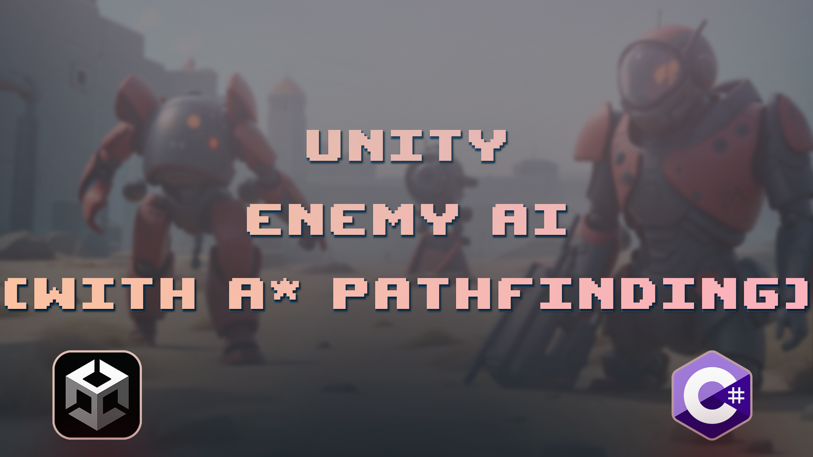

# Enemy AI (with A* pathfinding)

This repository contains a demonstration of an advanced Enemy AI system implemented in Unity using the A* pathfinding algorithm and the State Pattern. The Enemy AI is capable of dynamically navigating through a complex game environment to pursue the player while exhibiting different behaviors based on its current state.

# Features

### A* Pathfinding

The AI utilizes the A* pathfinding algorithm to efficiently navigate around obstacles and find the shortest path to the player's position.

### State Pattern

The AI behavior is designed using the State Pattern, allowing it to smoothly transition between different states such as "Idle," "Chase," and "Attack." This pattern enhances maintainability and extensibility of the AI system.

### Dynamic Obstacle Avoidance

The AI is capable of detecting dynamic obstacles and adjusts its path in real-time to avoid collisions.

### Customizable Behavior

The modular design of the AI system enables easy customization of AI states, behaviors, and transition conditions.

### Smooth Animations

The AI's movement and actions are accompanied by smooth animations, enhancing the overall gameplay experience.

## Customization
To customize the Enemy AI's behavior, you can:

- Add new states by creating classes that inherit from AIState and implementing the necessary logic for each state.

- Modify the state transition conditions in the state machine to change when the AI switches between behaviors.

- Adjust parameters in the A* pathfinding algorithm to fine-tune the AI's navigation accuracy and speed.

## Getting Started

To explore each design pattern example, follow these steps:

1. Clone this repository to your local machine.
2. Open the Unity project using Unity Hub.
3. Navigate to the Scenes folder and open the main demo scene.
4. Play the scene to see the Enemy AI in action. Observe how it transitions between different states and pursues the player using A* pathfinding.

## Credits

- A* pathfinding is based on [AstarPathfindingProject](https://arongranberg.com/astar/).